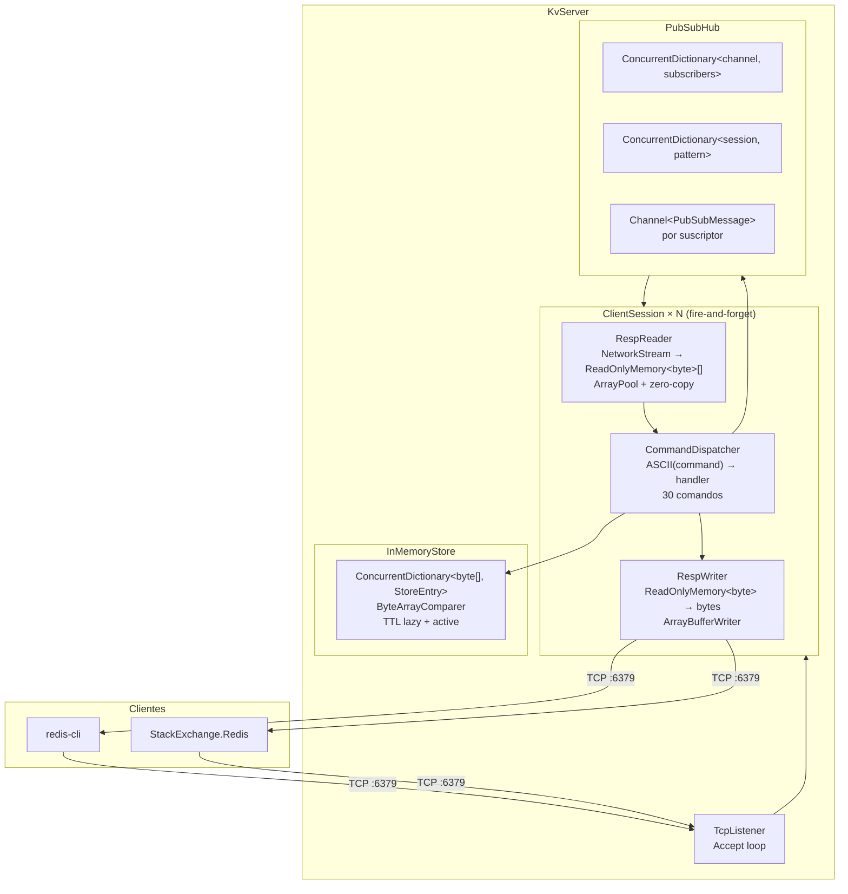
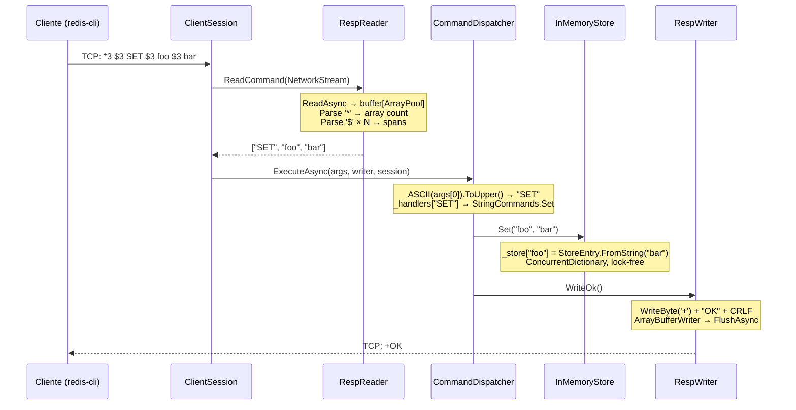
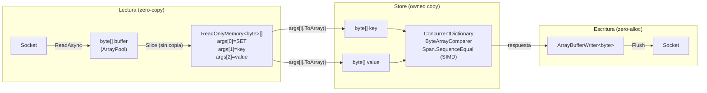
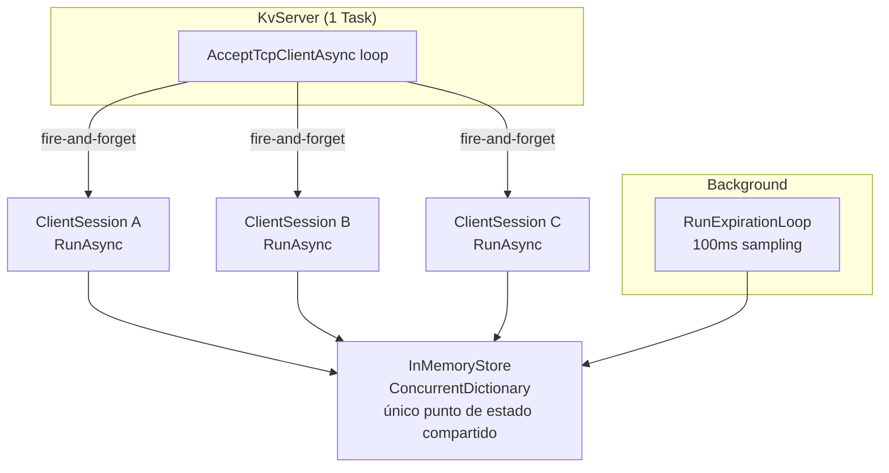
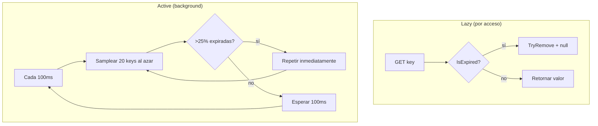

# Arquitectura: Key-Value Store RESP2

> Documento de arquitectura con diagramas y explicación detallada de cada capa.

---

## 1. Estructura del proyecto

```
key-value-store/
├── src/KeyValueStore.Server/
│   ├── Program.cs                    # Entry point, configuración
│   ├── CommandDispatcher.cs          # Ruteo comando → handler
│   ├── Glob.cs                       # Pattern matching (* y ?) para KEYS/PSUBSCRIBE
│   ├── IReplicationCoordinator.cs    # Interfaz para replicación (stub)
│   ├── Commands/
│   │   ├── HashCommands.cs           # HSET, HGET, HDEL, HGETALL, HEXISTS, HLEN
│   │   ├── KeyCommands.cs            # DEL, EXISTS, KEYS, DBSIZE, FLUSHALL, etc.
│   │   ├── PubSubCommands.cs         # PUBLISH, SUBSCRIBE, UNSUBSCRIBE, PSUBSCRIBE
│   │   ├── ServerCommands.cs         # PING, ECHO, QUIT, HELLO, CLIENT
│   │   ├── SetCommands.cs            # SADD, SREM, SMEMBERS, SISMEMBER, SCARD
│   │   └── StringCommands.cs         # SET, GET, INCR, DECR, SETEX, PSETEX
│   ├── Exceptions/
│   │   ├── ProtocolException.cs
│   │   └── QuitException.cs
│   ├── Networking/
│   │   ├── ClientSession.cs          # Estado por conexión, loop de comandos + push
│   │   └── KvServer.cs               # TcpListener, accept loop, fire-and-forget
│   ├── PubSub/
│   │   ├── PubSubHub.cs              # Canales, patrones, publish, subscribe
│   │   └── PubSubTypes.cs            # PubSubMessage, SubscriptionMode
│   ├── Resp/
│   │   ├── RespReader.cs             # RESP2 → ReadOnlyMemory<byte>[]
│   │   └── RespWriter.cs             # ReadOnlyMemory<byte> → RESP2
│   └── Store/
│       ├── ByteArrayComparer.cs      # IEqualityComparer<byte[]> (SIMD)
│       ├── InMemoryStore.cs          # ConcurrentDictionary + TTL + operaciones
│       └── StoreEntry.cs             # Valor + tipo (string/set/hash) + TTL
└── tests/KeyValueStore.Tests/
    ├── CommandDispatcherTests.cs     # 42 tests de ruteo
    ├── IntegrationTests.cs           # 18 tests TCP real
    ├── ServerFixture.cs              # xUnit fixture compartido (1 servidor)
    ├── StackExchangeRedisCompatibilityTests.cs  # 29 tests SE.Redis
    ├── PubSub/
    │   └── PubSubCommandsTests.cs    # 15 tests de pub/sub
    ├── Resp/
    │   ├── RespReaderTests.cs        # 12 tests de parseo
    │   └── RespWriterTests.cs        # 17 tests de serialización
    └── Store/
        └── InMemoryStoreTests.cs     # 52 tests del store
```

---

## 2. Diagrama de arquitectura



---

## 3. Flujo de un comando (SET/GET)



---

## 4. Flujo de Pub/Sub

```mermaid
sequenceDiagram
    participant Sub as Suscriptor
    participant Pub as Publicador
    participant Hub as PubSubHub
    participant CS_Sub as ClientSession (sub)
    participant CS_Pub as ClientSession (pub)

    rect rgb(25, 25, 50)
        Note over Sub,CS_Sub: Fase 1 — Suscripción
        Sub->>CS_Sub: SUBSCRIBE orders
        CS_Sub->>Hub: Subscribe("orders", session)
        Note over Hub: _channels["orders"][sessionId] = session
        CS_Sub->>Hub: EnterSubscriptionMode(Channel)
        CS_Sub-->>Sub: *3: subscribe, orders, :1
        Note over CS_Sub: Entra ReceivePushLoop<br/>Espera inbox o comandos socket
    end

    rect rgb(25, 50, 25)
        Note over Pub,CS_Pub: Fase 2 — Publicación
        Pub->>CS_Pub: PUBLISH orders "hola"
        CS_Pub->>Hub: Publish("orders", "hola")
        Note over Hub: Itera _channels["orders"]<br/>session.TryPush(message) → inbox
        Hub-->>CS_Sub: Channel.Writer.TryWrite(msg)
        CS_Pub-->>Pub: :1
    end

    rect rgb(50, 25, 25)
        Note over Sub,CS_Sub: Fase 3 — Entrega
        Note over CS_Sub: inbox.Reader.TryRead → msg
        CS_Sub->>CS_Sub: WritePush(msg)
        CS_Sub-->>Sub: *3: message, orders, hola
    end
```



### Formato de los mensajes Pub/Sub

Cada push que recibe el suscriptor es un array RESP2 con esta estructura:

| Posición | `message` | `pmessage` | `subscribe` | `unsubscribe` |
|---|---|---|---|---|
| `1)` | `"message"` | `"pmessage"` | `"subscribe"` | `"unsubscribe"` |
| `2)` | Canal | Patrón | Canal | Canal |
| `3)` | Payload | Canal | Count | Count |
| `4)` | — | Payload | — | — |

Ejemplo real con `redis-cli`:

```
1) "subscribe"       ← tipo
2) "orders"          ← canal
3) (integer) 1       ← count de suscriptores
1) "message"         ← tipo
2) "orders"          ← canal
3) "hola mundo"      ← payload
```

---

## 5. Pipeline de datos binary-safe



Sin conversiones `byte[] ↔ string` en ningún punto del hot path. `Encoding.ASCII` solo se usa para nombres de comando y metadata.

---

## 6. Modelo de concurrencia



- Cada `ClientSession` es un `Task` independiente (IOCP, sin hilos bloqueados).
- `InMemoryStore` usa `ConcurrentDictionary` — lecturas lock-free, escrituras por bucket.
- `PubSubHub` usa `ConcurrentDictionary` para canales y patrones.
- Excepciones atrapadas dentro de `RunAsync`, nunca llegan al accept loop.

---

## 7. TTL — Doble expiración



---

## 8. StackExchange.Redis — Compatibilidad

| Categoría | Comandos | Estado |
|---|---|---|
| Handshake | `HELLO`, `CLIENT SETNAME/SETINFO/ID` | ✅ Implementados |
| Strings | `SET`, `GET`, `SETEX`, `PSETEX`, `INCR`, `DECR` | ✅ |
| Keys | `DEL`, `EXISTS`, `KEYS`, `TTL`, `PTTL`, `EXPIRE`, `TYPE` | ✅ |
| Sets | `SADD`, `SREM`, `SMEMBERS`, `SISMEMBER`, `SCARD` | ✅ |
| Hashes | `HSET`, `HGET`, `HDEL`, `HGETALL`, `HEXISTS`, `HLEN` | ✅ |
| Pub/Sub | `PUBLISH`, `SUBSCRIBE`, `PSUBSCRIBE`, `UNSUBSCRIBE` | ✅ |
| Clustering | `CLUSTER NODES`, `CONFIG GET`, `INFO`, `SENTINEL MASTERS` | ⚠️ `-ERR` (SE.Redis lo tolera) |
| Interno | `__Booksleeve_MasterChanged` | ⚠️ Suscripción aceptada, sin publicaciones (sin Sentinel) |

---

## 9. Decisiones clave

| Decisión | Alternativa rechazada | Razón |
|---|---|---|
| RESP2 | protocolo propio | Compatibilidad universal con clientes Redis existentes |
| `ConcurrentDictionary` | `Dictionary` + `lock` | Lecturas lock-free, sin deadlocks, más simple |
| `async`/`await` + IOCP | Event loop single-threaded (como redis) | Comandos lentos no bloquean a otros clientes |
| `byte[]` para keys y valores | `string` | Binary-safe real, sin pérdida de datos, zero-copy en RespReader |
| `ArrayPool<byte>` en RespReader |  | Menos presión de GC, buffers reutilizados |
| `ArrayBufferWriter<byte>` en RespWriter | `StringBuilder` → `string` → `byte[]` | Dos allocs menos por respuesta |
| `ByteArrayComparer` con `SequenceEqual` | `Enumerable.SequenceEqual` | SIMD-accelerated, misma performance que `string.Equals` |
