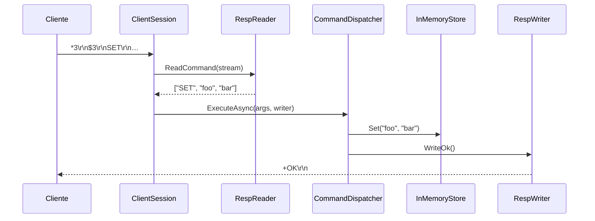

# Documento de Diseño: Key-Value Store in-memory con RESP2

> Base de datos clave-valor en memoria con protocolo RESP2.
> Implementado en C# / .NET 10. Cero dependencias externas.

---

## 1. Arquitectura

```mermaid
flowchart TB
    subgraph Client["Cliente"]
        RC[redis-cli / StackExchange.Redis]
    end

    subgraph Server["KvServer (TcpListener)"]
        direction TB
        subgraph Sessions["ClientSession (× N)"]
            direction LR
            RR[RespReader<br/>RESP → string[]]
            CD[CommandDispatcher<br/>arity → ruteo → ejecución]
            RW[RespWriter<br/>string[] → RESP]
            RR --> CD --> RW
        end
        subgraph Store["InMemoryStore"]
            IMS[ConcurrentDictionary<br/>+ TTL lazy + active<br/>+ INCR/DECR atómico]
        end
        CD --> IMS
    end

    RC -->|RESP2 TCP :6379| RR
    RW -->|RESP2 TCP :6379| RC
```

### Responsabilidades por capa

| Capa | Componentes | Responsabilidad |
|---|---|---|
| Transporte | `KvServer`, `ClientSession` | Aceptar conexiones TCP, una `Task` por conexión |
| Protocolo | `RespReader`, `RespWriter` | Parsear y serializar RESP2 |
| Ruteo | `CommandDispatcher` | Validar aridad, rutear al handler correcto |
| Almacenamiento | `InMemoryStore`, `StoreEntry` | Diccionario thread-safe, TTL, atomicidad |

### Flujo de una operación



---

## 2. Decisiones de diseño

### 2.1 RESP2 como protocolo

RESP2 (Redis Serialization Protocol v2) es el estándar de facto para bases de datos clave-valor en memoria. Usarlo permite que cualquier cliente Redis (`redis-cli`, `StackExchange.Redis`, librerías en Python, Go, Java, etc.) se conecte sin modificación.

RESP2 define seis tipos:

| Tipo | Formato | Ejemplo |
|---|---|---|
| Simple String | `+…\r\n` | `+OK\r\n` |
| Error | `-…\r\n` | `-ERR unknown command\r\n` |
| Integer | `:N\r\n` | `:42\r\n` |
| Bulk String | `$LEN\r\n…\r\n` | `$3\r\nbar\r\n` |
| Null | `$-1\r\n` | Key no encontrada |
| Array | `*N\r\n…` | `*2\r\n$3\r\nGET\r\n$3\r\nfoo\r\n` |

También se soportan comandos inline (`PING\r\n`) para compatibilidad con telnet/netcat.

### 2.2 `ConcurrentDictionary` en vez de `Dictionary` + `lock`

Las lecturas son lock-free en el path común. Escrituras a buckets distintos no compiten. Sin riesgo de deadlocks ni de olvidar un lock. Toda la concurrencia está encapsulada dentro de `InMemoryStore` — quien lo usa nunca ve un lock.

### 2.3 `async`/`await` con IOCP en vez de event loop single-threaded

Por debajo, .NET usa IOCP/epoll — cero hilos bloqueados en I/O. A diferencia del modelo single-threaded donde un comando lento (`KEYS *` con 100k keys) bloquea a todos los clientes, acá cada sesión corre en su propio `Task`. `ConcurrentDictionary` permite lecturas y escrituras concurrentes a nivel de bucket, por lo que otros clientes pueden seguir operando mientras uno está iterando.

### 2.4 TTL con doble expiración (lazy + active sampling)

- **Lazy**: cada `GET`, `EXISTS`, `KEYS`, `DBSIZE`, `TTL` verifica `IsExpired`. Si expiró, `TryRemove` y se trata como inexistente. Garantiza nunca devolver un valor expirado. Overhead: ~10ns por acceso.
- **Active**: loop en background que cada 100ms samplea 20 keys al azar, elimina las expiradas, y repite inmediatamente si más del 25% estaban expiradas. Evita acumulación de memoria.

Redis usa exactamente esta combinación.

### 2.5 Estrategia zero-allocation

Cada request TCP genera objetos temporales que el garbage collector debe limpiar. A alto volumen, esto produce pausas que degradan la latencia. Para mitigarlo se aplicaron dos optimizaciones:

- **`RespReader`**: el buffer donde se leen los bytes del socket se pide prestado a un pool (`ArrayPool<byte>.Shared`) y se devuelve al cerrar la conexión. Se evita asignar un buffer nuevo por cada request.
- **`RespWriter`**: en vez de construir la respuesta con `StringBuilder`, convertirla a `string` y luego a `byte[]`, se escribe directo a bytes usando `ArrayBufferWriter<byte>`. Esto evita dos asignaciones por respuesta.

El resultado es menos presión sobre el garbage collector y latencia más pareja bajo carga.

---

## 3. Modelo de concurrencia

```
KvServer (1 Task)
  ├── ClientSession A (fire-and-forget)
  │     └── RespReader → CommandDispatcher → InMemoryStore
  ├── ClientSession B (fire-and-forget)
  ├── ClientSession C (fire-and-forget)
  └── RunExpirationLoop (fire-and-forget)
```

- Sin estado mutable compartido entre sesiones.
- `InMemoryStore` es el único punto de concurrencia.
- Excepciones atrapadas dentro de `ClientSession.RunAsync`, nunca llegan al accept loop.

---

## 4. Manejo de errores

- **Errores de cliente**: devueltos como RESP error (`-ERR …\r\n`). Nunca crashean el servidor.
- **Errores de protocolo**: `ProtocolException` → conexión cerrada limpiamente.
- **Errores de I/O**: `IOException` → conexión cerrada silenciosamente.

---

## 5. Tests

| Nivel | Cantidad | Qué prueba |
|---|---|---|
| `InMemoryStoreTests` | 31 | Operaciones del store, TTL, concurrencia, expiración activa |
| `RespReaderTests` | 12 | Parseo de arrays RESP, comandos inline, edge cases |
| `RespWriterTests` | 17 | Todos los tipos RESP, null/empty, round-trip |
| `CommandDispatcherTests` | 28 | Los 15 comandos, errores de aridad, comando desconocido |
| `IntegrationTests` | 18 | TCP real con `RespWriter`/`RespReader` en ambos extremos |
| **Total** | **106** | **0 fallados, ~1.5s** |

---

## 6. Comandos soportados

| Comando | Tipo | Descripción |
|---|---|---|
| `PING [msg]` | Server | `+PONG` o eco |
| `ECHO msg` | Server | Eco como bulk string |
| `SET key value [EX s\|PX ms]` | String | Setear con TTL opcional |
| `GET key` | String | Obtener valor o null |
| `DEL key […]` | Key | Borrar keys, retorna count |
| `EXISTS key […]` | Key | Contar keys existentes |
| `KEYS pattern` | Key | Glob match (`*`, `?`) |
| `DBSIZE` | Key | Cantidad de keys activas |
| `FLUSHALL` | Key | Vaciar el store |
| `EXPIRE key seconds` | Key | Setear TTL |
| `TTL key` | Key | Segundos restantes |
| `TYPE key` | Key | `string` o `none` |
| `INCR key` | String | Incremento atómico |
| `DECR key` | String | Decremento atómico |
| `QUIT` | Server | Cerrar conexión |

---

## 7. Mejoras a futuro

| Mejora | Descripción |
|---|---|
| Sets, Hashes, SortedSets | Tipos de datos adicionales más allá de strings |
| Pub/Sub | Mensajería publish-subscribe entre clientes |
| Soporte multi-instancia | Replicación y alta disponibilidad con múltiples nodos |
