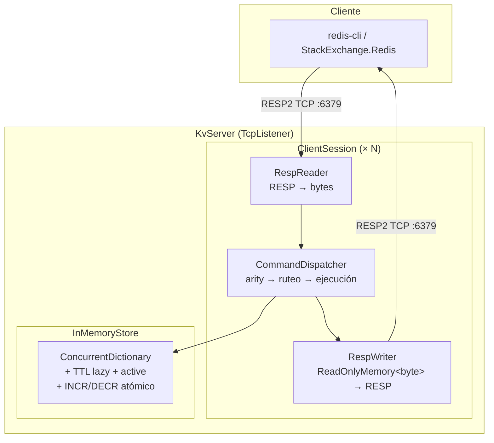
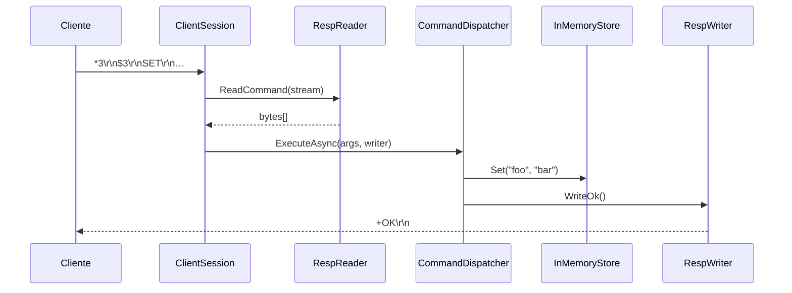
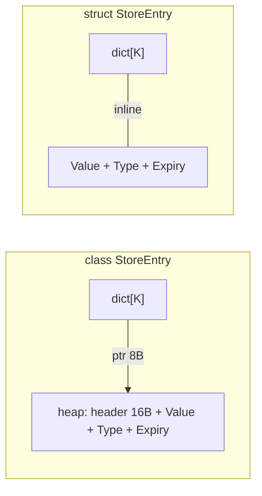

# Documento de Diseño: Key-Value Store in-memory con RESP2

> Base de datos clave-valor en memoria con protocolo RESP2.
> Implementado en C# / .NET 10. Cero dependencias externas.

---

## 1. Arquitectura



### Responsabilidades por capa

| Capa | Componentes | Responsabilidad |
|---|---|---|
| Transporte | `KvServer`, `ClientSession` | Aceptar conexiones TCP, una `Task` por conexión |
| Protocolo | `RespReader`, `RespWriter` | Parsear y serializar RESP2 |
| Ruteo | `CommandDispatcher` | Validar aridad, rutear al handler correcto |
| Almacenamiento | `InMemoryStore`, `StoreEntry` | Diccionario thread-safe, TTL, atomicidad |

### Flujo de una operación



---

## 2. Decisiones de diseño

### 2.1 RESP2 como protocolo

RESP2 (Redis Serialization Protocol v2) es el estándar de facto para bases de datos clave-valor en memoria. Usarlo permite que cualquier cliente Redis (`redis-cli`, `StackExchange.Redis`, librerías en Python, Go, Java, etc.) se conecte sin modificación.

RESP2 define seis tipos:

| Tipo | Formato | Ejemplo |
|---|---|---|
| Simple String | `+…\r\n` | `+OK\r\n` |
| Error | `-…\r\n` | `-ERR unknown command\r\n` |
| Integer | `:N\r\n` | `:42\r\n` |
| Bulk String | `$LEN\r\n…\r\n` | `$3\r\nbar\r\n` |
| Null | `$-1\r\n` | Key no encontrada |
| Array | `*N\r\n…` | `*2\r\n$3\r\nGET\r\n$3\r\nfoo\r\n` |

También se soportan comandos inline (`PING\r\n`) para compatibilidad con telnet/netcat.

### 2.2 `ConcurrentDictionary` en vez de `Dictionary` + `lock`

Las lecturas son lock-free en el path común. Escrituras a buckets distintos no compiten. Sin riesgo de deadlocks ni de olvidar un lock. Toda la concurrencia está encapsulada dentro de `InMemoryStore` — quien lo usa nunca ve un lock.

### 2.3 `async`/`await` con IOCP en vez de event loop single-threaded

Por debajo, .NET usa IOCP/epoll — cero hilos bloqueados en I/O. A diferencia del modelo single-threaded donde un comando lento (`KEYS *` con 100k keys) bloquea a todos los clientes, acá cada sesión corre en su propio `Task`. `ConcurrentDictionary` permite lecturas y escrituras concurrentes a nivel de bucket, por lo que otros clientes pueden seguir operando mientras uno está iterando.

### 2.4 TTL con doble expiración (lazy + active sampling)

- **Lazy**: cada `GET`, `EXISTS`, `KEYS`, `DBSIZE`, `TTL` verifica `IsExpired`. Si expiró, `TryRemove` y se trata como inexistente. Garantiza nunca devolver un valor expirado. Overhead: ~10ns por acceso.
- **Active**: loop en background que cada 100ms samplea 20 keys al azar, elimina las expiradas, y repite inmediatamente si más del 25% estaban expiradas. Evita acumulación de memoria.

Redis usa exactamente esta combinación.

### 2.5 Estrategia zero-allocation

Cada request TCP genera objetos temporales que el garbage collector debe limpiar. A alto volumen, esto produce pausas que degradan la latencia. Para mitigarlo se aplicaron: tres optimizaciones:

- **`RespReader`**: el buffer donde se leen los bytes del socket se pide prestado a un pool (`ArrayPool<byte>.Shared`) y se devuelve al cerrar la conexión. Se evita asignar un buffer nuevo por cada request.
- **`RespWriter`**: en vez de construir la respuesta con `StringBuilder`, convertirla a `string` y luego a `byte[]`, se escribe directo a bytes usando `ArrayBufferWriter<byte>`. Esto evita dos asignaciones por respuesta.
- **Pipeline de datos en `byte[]`**: los comandos se leen como `ReadOnlyMemory<byte>[]` apuntando directamente al buffer interno del `RespReader` (zero-copy). Tanto keys como valores se almacenan como `byte[]` en el store, sin conversiones de encoding — binary-safe de punta a punta, idéntico a Redis real. Sets y hashes usan `ByteArrayComparer` para igualdad estructural de bytes, y el `ConcurrentDictionary` de keys usa el mismo comparer.
- **`StoreEntry` como `struct`**: cada entry vive inline en el slot del `ConcurrentDictionary`, sin objeto heap separado. Con 100k keys, son 100k objetos menos que el GC no tiene que barrer.
- **`TcpClient.NoDelay = true`**: desactiva el algoritmo de Nagle. Respuestas chicas (`+OK\r\n`, `:1\r\n`) se envían inmediatamente sin esperar a acumular más datos. Crítico en RESP2 donde cada respuesta es un paquete independiente.



El resultado es menos presión sobre el garbage collector y latencia más pareja bajo carga.

### 2.6 Tradeoffs encontrados al integrar con StackExchange.Redis

Al validar el servidor contra el cliente .NET más popular (`StackExchange.Redis`) surgieron varios problemas que forzaron decisiones de diseño adicionales:

**Comandos faltantes.** SE.Redis envía durante el handshake comandos que Redis real soporta pero nuestro servidor no tenía: `CLIENT SETNAME`, `CLIENT SETINFO`, `CLIENT ID`, `HELLO` (negociación RESP3), `SETEX`, `PSETEX`, `PTTL`, `CONFIG GET`, `INFO`, `CLUSTER NODES`, `SENTINEL MASTERS`. Los primeros seis se implementaron; el resto devuelven error y SE.Redis los tolera.

**Pipelining en el buffer.** SE.Redis envía múltiples comandos en una sola ráfaga TCP (ej. `CLIENT SETNAME` + `CLIENT SETINFO` + `ECHO`). El `RespReader` original leía todo del socket, procesaba solo el primer comando y descartaba el resto. Se corrigió para consumir comandos del buffer remanente antes de leer más del stream.

**Encoding y binary-safety.** SE.Redis valida la conexión con un `ECHO` que contiene bytes aleatorios binarios (tracer). El `RespReader` usaba `UTF8.GetString` para decodificar bulk strings, y `RespWriter` usaba `UTF8.GetBytes` para codificarlas. El round-trip `bytes → UTF-8 string → UTF-8 bytes` corrompe datos no-UTF8 (caracteres de reemplazo U+FFFD). Se migró todo el pipeline de datos a `ReadOnlyMemory<byte>`/`byte[]` — no hay ningún encoding intermedio, igual que Redis real en C.

**Conexiones de suscripción.** SE.Redis abre conexiones separadas para pub/sub y suscribe al canal interno `__Booksleeve_MasterChanged`. El servidor maneja correctamente estas suscripciones — cada conexión TCP recibe un `ClientSession` automáticamente. El canal existe para escuchar failovers vía Redis Sentinel, funcionalidad que requiere soporte multi-instancia (ver sección 7).

**Soporte multi-instancia (principal tradeoff pendiente).** SE.Redis espera ciertos comandos de clustering que el servidor aún no soporta (`CLUSTER NODES`, `CONFIG GET`, `INFO`, `SENTINEL MASTERS`). Estos comandos devuelven error y SE.Redis los tolera, pero para un failover real se necesitaría implementar replicación maestro-réplica y el protocolo Sentinel. Hacerlo implicaría: sincronización de estado entre nodos, elección de líder, redirección de escrituras, y publicación en `__Booksleeve_MasterChanged` ante cambios de topología.

---

## 3. Modelo de concurrencia

```
KvServer (1 Task)
  ├── ClientSession A (fire-and-forget)
  │     └── RespReader → CommandDispatcher → InMemoryStore
  ├── ClientSession B (fire-and-forget)
  ├── ClientSession C (fire-and-forget)
  └── RunExpirationLoop (fire-and-forget)
```

- Sin estado mutable compartido entre sesiones.
- `InMemoryStore` es el único punto de concurrencia.
- Excepciones atrapadas dentro de `ClientSession.RunAsync`, nunca llegan al accept loop.

---

## 4. Manejo de errores

- **Errores de cliente**: devueltos como RESP error (`-ERR …\r\n`). Nunca crashean el servidor.
- **Errores de protocolo**: `ProtocolException` → conexión cerrada limpiamente.
- **Errores de I/O**: `IOException` → conexión cerrada silenciosamente.

---

## 5. Tests

| Nivel | Cantidad | Qué prueba |
|---|---|---|
| `InMemoryStoreTests` | 52 | Operaciones del store, TTL, concurrencia, sets, hashes |
| `RespReaderTests` | 12 | Parseo de arrays RESP, comandos inline, edge cases |
| `RespWriterTests` | 17 | Todos los tipos RESP, null/empty, round-trip |
| `CommandDispatcherTests` | 42 | Los 26 comandos, errores por cantidad incorrecta de argumentos, comandos desconocidos |
| `PubSubCommandsTests` | 15 | Publicar, suscribir, unsubscribe, sesiones |
| `IntegrationTests` | 18 | TCP real con `RespWriter`/`RespReader` en ambos extremos |
| `StackExchangeRedisCompatibilityTests` | 29 | Validación de compatibilidad con la librería `StackExchange.Redis` |
| **Total** | **206** | **28/29 SE.Redis, 100% resto** |

---

## 6. Comandos soportados

| Comando | Tipo | Descripción |
|---|---|---|
| `PING [msg]` | Server | `+PONG` o eco |
| `ECHO msg` | Server | Eco como bulk string |
| `HELLO` | Server | Negociación RESP3 → responde con proto=2 |
| `CLIENT SETNAME\|SETINFO\|ID` | Server | Handshake de cliente (StackExchange.Redis) |
| `QUIT` | Server | Cerrar conexión |
| `SET key value [EX s\|PX ms]` | String | Setear con TTL opcional |
| `SETEX key seconds value` | String | SET con expiración en segundos |
| `PSETEX key ms value` | String | SET con expiración en milisegundos |
| `GET key` | String | Obtener valor o null |
| `INCR key` | String | Incremento atómico |
| `DECR key` | String | Decremento atómico |
| `DEL key […]` | Key | Borrar keys, retorna count |
| `EXISTS key […]` | Key | Contar keys existentes |
| `KEYS pattern` | Key | Glob match (`*`, `?`) |
| `DBSIZE` | Key | Cantidad de keys activas |
| `FLUSHALL` | Key | Vaciar el store |
| `EXPIRE key seconds` | Key | Setear TTL |
| `TTL key` | Key | Segundos restantes |
| `PTTL key` | Key | Milisegundos restantes |
| `TYPE key` | Key | `string`, `set`, `hash` o `none` |
| `SADD key member […]` | Set | Agregar miembros |
| `SREM key member […]` | Set | Eliminar miembros |
| `SMEMBERS key` | Set | Listar todos los miembros |
| `SISMEMBER key member` | Set | Verificar pertenencia |
| `SCARD key` | Set | Cantidad de miembros |
| `HSET key field value` | Hash | Setear campo |
| `HGET key field` | Hash | Obtener campo |
| `HDEL key field […]` | Hash | Eliminar campos |
| `HGETALL key` | Hash | Listar todos los campos |
| `HEXISTS key field` | Hash | Verificar existencia de campo |
| `HLEN key` | Hash | Cantidad de campos |

---

## 7. Mejoras a futuro

| Mejora | Descripción |
|---|---|
| Soporte multi-instancia | Replicación maestro-réplica, failover automático con Sentinel, y publicación en `__Booksleeve_MasterChanged`. Necesario para que SE.Redis opere en modo alta disponibilidad. |
